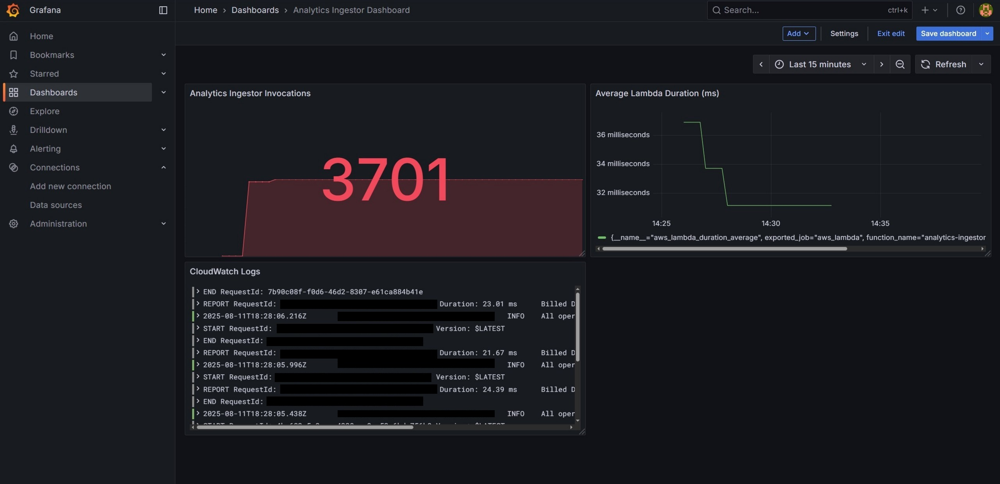
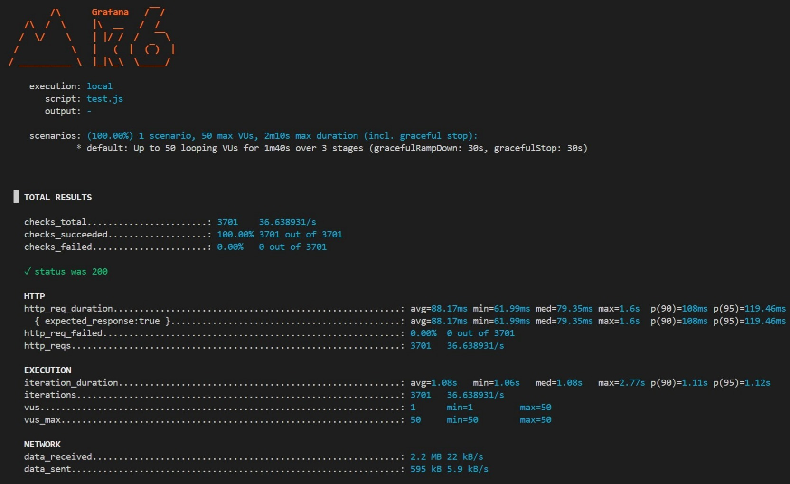

# High-Throughput, Observable Web Analytics Pipeline on AWS
## Project Overview

This project is a complete, cloud-native web analytics ingestion pipeline built entirely on AWS and deployed using Infrastructure as Code. It is designed to receive a high volume of analytics events, process them, store them across multiple databases (NoSQL, Relational, and Object Storage), and provide real-time observability into the system's performance and health.

## Architecture Diagram
The system is architected for scalability, resilience, and observability using managed AWS services.

### Data Flow:

1. A `POST` request with an event payload is sent to an API Gateway endpoint.
2. The endpoint triggers a Node.js Lambda function.
3. The Lambda function processes the event and concurrently writes it to three destinations:
   * The raw event is stored in an S3 Bucket for data lake/archival purposes.

   * A processed version of the event is stored in a DynamoDB (NoSQL) table for fast lookups.

   * An aggregated count of the event type is incremented in a PostgreSQL RDS (Relational) database.

4. All infrastructure is monitored by a Grafana stack running on a dedicated EC2 instance, pulling metrics from CloudWatch and logs from CloudWatch Logs.

## Tech Stack
* Cloud Provider: AWS
* Infrastructure as Code: Terraform
* Compute: AWS Lambda (Node.js)
* API Layer: AWS API Gateway (REST API)
* Storage:
    * Object Storage: AWS S3
    * NoSQL Database: AWS DynamoDB
    * Relational Database: AWS RDS for PostgreSQL
* Networking & Security: AWS VPC, Subnets, Security Groups, IAM Roles, VPC Endpoints
* Secrets Management: AWS Secrets Manager
* Monitoring & Observability: Grafana, Prometheus, Loki, Promtail, CloudWatch Exporter
* Containerization: Docker & Docker Compose
* Performance Testing: k6

## Features
* Cloud Engineering (AWS): Deployed and configured a wide range of AWS services (VPC, Lambda, API Gateway, S3, DynamoDB, RDS, EC2, IAM, Secrets Manager).
* Infrastructure as Code (Terraform): The entire infrastructure is 100% managed by Terraform, ensuring repeatable and version-controlled deployments.
* Serverless & High Throughput: Utilized API Gateway and Lambda to build a scalable, high-throughput ingestion endpoint capable of handling thousands of requests.
* Databases: Stores events received across multiple databases (NoSQL, Relational, and Object Storage).
* Observability: Built a complete monitoring stack with Grafana to visualize real-time metrics (invocations, latency) and structured logs.
* Secure Networking: Designed and implemented a secure network using a VPC, private/public subnets, and VPC Endpoints to ensure secure communication between services without exposing them to the public internet.

## Performance Test Results
To validate the system's high-throughput capabilities, a load test was conducted using k6. The test simulated a ramp-up to 50 virtual users sending requests concurrently over a 2-minute period.

**The system successfully processed over 3,700 requests with zero errors.**

Grafana Dashboard Under Load:

k6 Test Summary:

## Setup & Deployment
1. Prerequisites: AWS Account, Terraform, Node.js.

2. Clone the repository: `git clone https://github.com/KianFatemi/aws-analytics-pipeline.git`

3. Navigate to the `src` directory and install dependencies: `cd src && npm install && cd ..`

4. Initialize Terraform: `terraform init`

5. Deploy the infrastructure: `terraform apply`

6. The API endpoint URL and the Grafana dashboard URL will be provided as outputs.